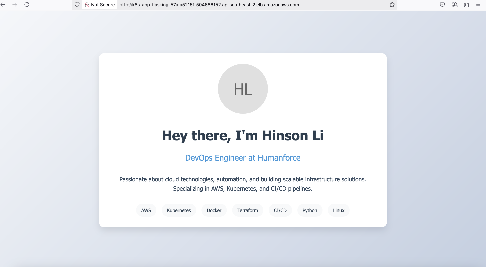

# Flask EKS Auto-Mode Application

A containerized Python Flask application deployed on Amazon EKS (Elastic Kubernetes Service) with automated CI/CD pipeline using GitHub Actions, OIDC authentication, and EKS auto mode.

## Architecture

- **App**: Python Flask REST API
- **Infrastructure**: Amazon EKS cluster (auto mode)
- **Container Registry**: Amazon ECR
- **Load Balancing**: AWS Load Balancer Controller (ALB Ingress)
- **CI/CD**: GitHub Actions workflow

## Features

- **Containerized Flask App**: Dockerized Python Flask API
- **Kubernetes Orchestration**: Managed EKS cluster with auto mode
- **Automated Deployment**: GitHub Actions workflow for CI/CD
- **Load Balancing**: Application Load Balancer with health checks
- **OIDC Authentication**: Secure GitHub Actions to AWS via OIDC
- **Infrastructure as Code**: eksctl configuration files

## Prerequisites

- **AWS Account** with appropriate permissions
- **GitHub repository** with Actions enabled
- **Local Development Tools**:
  - Docker
  - kubectl
  - eksctl
  - AWS CLI


## Setup

### Bootstrap Steps. Run on your local machine.

<BR>

**Step 1: Retrieve the SHA-1 Fingerprint (Thumbprint) of GitHub's OIDC SSL Certificate**

Run the following command to fetch the SHA-1 fingerprint (thumbprint) of GitHub's OIDC provider SSL certificate (token.actions.githubusercontent.com) in the correct format for AWS:

```bash
echo | openssl s_client -servername token.actions.githubusercontent.com -showcerts -connect token.actions.githubusercontent.com:443 2>/dev/null | openssl x509 -fingerprint -noout | sed 's/SHA1 Fingerprint=//' | tr -d ':'
```

Expected Output: A 40-character hexadecimal string.

<BR>

**Step 2: Create the OIDC Provider in AWS**

Using the thumbprint retrieved in Step 1, create an OIDC provider in AWS to allow GitHub Actions to authenticate via OIDC:

```bash
aws iam create-open-id-connect-provider \
  --url https://token.actions.githubusercontent.com \
  --client-id-list sts.amazonaws.com \
  --thumbprint-list <40-character hexadecimal string from step 1>
```

Expected Output:
```json
{
    "OpenIDConnectProviderArn": "arn:aws:iam::154864927037:oidc-provider/token.actions.githubusercontent.com"
}
```

<BR>

**Step 3: Verify the OIDC Provider**

Verify that the OIDC provider was created successfully:

```bash
aws iam list-open-id-connect-providers
```

Expected Output:
```json
{
    "OpenIDConnectProviderList": [
        {
            "Arn": "arn:aws:iam::154864927037:oidc-provider/token.actions.githubusercontent.com"
        }
    ]
}
```

<BR>

**Step 4: Clone the repository locally and configure GitHubActionsRole and GitHubActionsPolicy**

<BR>

**Note:** The GitHubActionsRole and its associated policy (GitHubActionsPolicy) grant GitHub Actions the necessary permissions to deploy your infrastructure. These resources should be managed via Terraform under `project_bootstrap` directory.

Navigate to the Bootstrap Directory:

```bash
cd Terraform-Experiment/terraform/project_bootstrap/iam_json
```

Create/update IAM JSON files (Policy & Role) inside:
- `Terraform-Experiment/terraform/project_bootstrap/iam_json/GitHubActionsPolicy.json`
- `Terraform-Experiment/terraform/project_bootstrap/iam_json/GitHubActionsRole.json`

**Note:** In the GitHubActionsPolicy, broader permissions are granted. For improved security, consider scoping down each statement to specific resources or permissions.

<BR>

**Step 5: Update terraform state S3 bucket configuration**

Update configuration in `Terraform-Experiment/terraform/project_bootstrap/tfvars/main.tfvar`:

```hcl
account_number    = "154864927037"
aws_region        = "ap-southeast-2"
state_bucket_name = "terraform-state-19042025"
environment       = "assessment"
```

<BR>

**Step 6: Initialize the Bootstrap Project**

Initialize the Terraform project in the bootstrap directory to create the state bucket, DynamoDB table, and IAM role/policy.

Navigate to the Bootstrap Directory (if not already there):
```bash
cd Terraform-Experiment/terraform/project_bootstrap
```

Initialize Terraform:
```bash
terraform init
```

Generate a Plan:
```bash
terraform plan --var-file=tfvars/main.tfvar
```

Apply the Changes: If the plan looks correct, apply it to create the resources:
```bash
terraform apply --var-file=tfvars/main.tfvar
```

This creates:
- The Terraform state bucket (e.g. terraform-state-19042025)
- The DynamoDB table (terraform-locks) for state locking
- The GitHubActionsRole and GitHubActionsPolicy

<BR>

**Step 7: Verify the Setup**

Check the State Bucket:
```bash
aws s3 ls --region ap-southeast-2 | grep terraform-state
```

Check the DynamoDB Table:
```bash
aws dynamodb list-tables --region ap-southeast-2
```

Check the IAM Role:
```bash
aws iam get-role --role-name GitHubActionsRole
```

## Project Structure

```
05Python-Flask-EKS-Auto-Mode-App/
├── .github/workflows/
│   └── deployment.yml          # GitHub Actions CI/CD pipeline
├── eksctl/
│   └── cluster.yaml           # EKS cluster config (auto mode)
├── k8s/
│   └── flask.yaml             # Flask app K8s manifests
├── flask-app/
│   ├── app.py                 # Flask app code
│   ├── Dockerfile             # Flask app Dockerfile
│   └── requirements.txt       # Python dependencies
└── README.md
```

## Flask Application

- **/health**: Health check endpoint
- **/api/hello**: Sample API endpoint

## Deployment

### Automated Deployment

1. **Trigger GitHub Actions Workflow**:
   - Go to GitHub Actions tab
   - Select "EKS Deployment and Cleanup"
   - Choose "deploy" action
   - Enter cluster name (e.g., "flask-auto-cluster")
   - Run workflow

2. **The workflow will**:
   - Build and push Docker image to ECR
   - Create EKS cluster (auto mode) with eksctl
   - Install AWS Load Balancer Controller
   - Deploy Flask application
   - Provision Application Load Balancer

## Accessing the Application

After deployment, access your application:

1. **Get the ALB URL**:
```bash
kubectl get ingress flask-ingress -n app -o jsonpath='{.status.loadBalancer.ingress[0].hostname}'
```

2. **Open in browser**: `http://<alb-url>`

## Result

The deployed application successfully displays "Hinson's Cats" with data fetched from the backend API:



## Cleanup

### Automated Cleanup
1. Go to GitHub Actions
2. Select "EKS Deployment and Cleanup"
3. Choose "destroy" action
4. Run workflow

### Manual Cleanup
```bash
kubectl delete -f k8s/
eksctl delete cluster -f eksctl/cluster.yaml
aws ecr delete-repository --repository-name flask-app --force
``` 